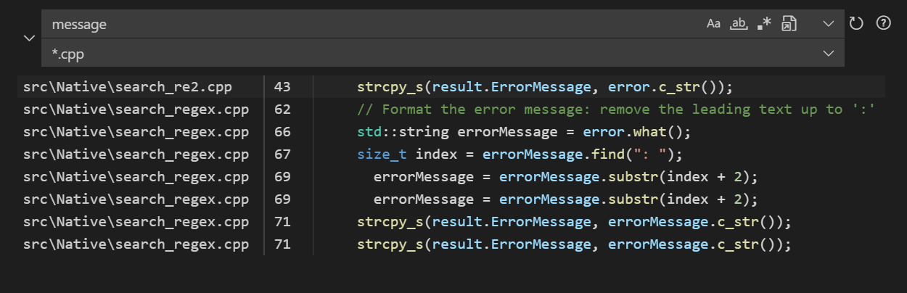

# vsc-resident-ui

Fast and scalable search for VS Code. Uses the VS Chromium search engine internally. Only works on Windows.

## Features

 - Very fast search in extremely large codebases
 - Very fast indexing. No need to wait 30 minutes for the search to warm up.
 - Supports regex, file path search, ...
 - Syntax highlighting in search results
 - Experimental regex-based go-to-definition
 - Supports VS Code remote development

## Requirements

Requires the [resident-workspace](https://marketplace.visualstudio.com/items?itemName=wouterdek.vsc-resident-workspace) plugin to function.
See [this guide](https://chromium.github.io/vs-chromium/#getting-started-project-file) on how to set up your project for use with this plugin.
